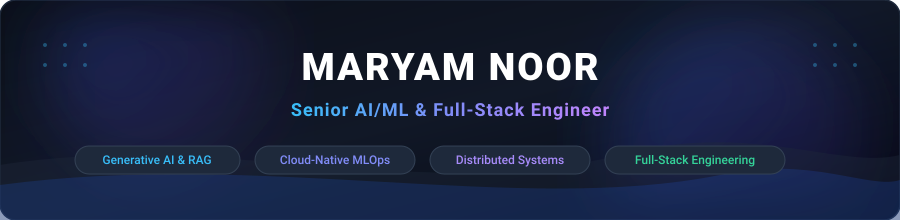

  

  
  
  

 

### 👋 Hi, I'm Maryam Noor

I am a **Senior AI/ML & Full-Stack Engineer** specializing in the design, architecture, and deployment of intelligent, high-throughput, production-grade distributed systems.

My expertise bridges the gap between **Generative AI / Large Language Models**, **Advanced Machine Learning**, **Scalable Data Pipelines**, and **Cloud-Native MLOps**. Over the past 6+ years across enterprise software environments (**Force Cloud LLC**, **LiveRamp**, and **Perforce Software**), I have engineered end-to-end AI applications, real-time streaming fraud detection engines, credit scoring scorecards, and multi-cloud infrastructure handling millions of daily events with sub-millisecond latencies.

---

## ⚡ Tech Snapshot

| Domain | Technologies & Frameworks |
| :--- | :--- |
| **🤖 Generative AI & NLP** | `LangChain` `LlamaIndex` `PyTorch` `HuggingFace Transformers` `XLM-RoBERTa` `CLIP/ViT` `Vector Databases (Qdrant, FAISS)` `Prompt Engineering` `Fine-Tuning` `RAG Architectures` `Explainable AI (SHAP)` |
| **💻 Full-Stack & Microservices** | `Python` `FastAPI` `Flask` `Django` `React` `Next.js` `Node.js` `TypeScript` `RESTful APIs` `GraphQL` `WebSockets` `Uvicorn` |
| **📊 Big Data & ML Pipelines** | `Apache Airflow` `Apache Kafka` `Apache Spark` `XGBoost` `LightGBM` `Scikit-Learn` `Pandas` `NumPy` `Feature Store (Feast)` `PostgreSQL` `Redis` |
| **☁️ Cloud, MLOps & Infra** | `AWS (EKS, S3, SageMaker)` `Docker` `Kubernetes` `Helm` `MLflow` `Great Expectations` `Prometheus` `Grafana` `Terraform` `CI/CD (GitHub Actions)` |
| **🏛️ Core Architecture** | `Distributed Systems` `Microservices` `Event-Driven Architecture` `Zero-Downtime Blue/Green Deployments` `High-Throughput Streaming` `API Gateways` |

 

### 🛠️ Visual Technology Matrix

  <!-- AI / ML -->
  
  
  
  
  
  
  
   
  <!-- Backend & Data -->
  
  
  
  
  
  
  
  
  
   
  <!-- Cloud & DevOps -->
  
  
  
  
  
  
  
  

---

## 📈 Engineering Footprint & Production Impact

  
  
  
  

 

| Operational Area | Metric Benchmark | Production Architecture Highlights |
| :--- | :---: | :--- |
| **Real-Time Fraud Screening** | `< 12ms P99` | Dual-tier XGBoost & LightGBM ensemble with Redis rolling velocity windows |
| **Underwriting & Risk Scoring** | `< 50ms P99` | Weight-of-Evidence scorecard decisioning with React executive console |
| **Enterprise RAG Retrieval** | `< 450ms E2E` | Hybrid HNSW vector indexing (Qdrant), dense cross-encoders & RRF reranking |
| **Customer LTV & Churn** | `89% ROC-AUC` | Multi-stage Airflow DAG orchestration, automated drift alerts & PostgreSQL |
| **Multimodal Content Audit** | `37% Precision ↑` | Zero-shot Vision-Language CLIP embeddings & ViT policy risk classifiers |
| **Active Learning Annotation** | `65% Time Saved` | Margin uncertainty sampling loop with SpaCy intent classification |
| **Retail Demand Forecasting** | `28% Out-of-Stock ↓`| Hierarchical time-series lag decomposition across 1,200+ SKU clusters |
| **Cloud-Native MLOps Platform** | `Zero-Downtime` | Automated blue/green Canary rollouts, Feast feature store & Helm on EKS |

---

## 🏆 Featured Production Architectures

### 🚀 1. Cloud-Native MLOps & Distributed Infrastructure

* **Enterprise Cloud-Native MLOps Platform & Feature Store** *(2023 – 2026)*  
  Unified MLOps infrastructure built on Kubernetes (EKS) with Feast feature store, MLflow model tracking, Prometheus drift alerts, and automated Helm CI/CD pipelines.  
  `Kubernetes` `Feast Feature Store` `MLflow` `Prometheus` `Grafana` `Docker` `Helm` `AWS`

* **Enterprise RAG Knowledge Retrieval & AI Assistant Platform** *(2021 – 2026)*  
  Enterprise document intelligence platform integrating LangChain, Qdrant vector database, Reciprocal Rank Fusion (RRF), cross-encoder re-ranking, and streaming chat interface.  
  `LangChain` `Qdrant Vector DB` `FastAPI` `Asyncio` `RRF Reranking` `Enterprise Search`

* **Graph Entity Resolution & Insurance Claims Fraud Detection** *(2022 – 2023)*  
  Uncovering organized fraud syndicates and synthetic identity rings using Neo4j property graphs, Graph Neural Networks (GNN), and NetworkX community detection algorithms.  
  `Neo4j` `Graph Neural Networks` `NetworkX` `Community Detection` `FastAPI`

---

### ⚡ 2. Real-Time Streaming & Financial Risk Analytics

* **High-Throughput Real-Time Streaming Fraud Screening Engine** *(2020 – 2026)*  
  Sub-12ms transaction screening service utilizing stacked gradient boosted classifiers (XGBoost + LightGBM), sliding event velocity windows in Redis, and real-time SHAP explainability. Reduced false declines by **34%**.  
  `XGBoost` `LightGBM` `SHAP XAI` `FastAPI` `Redis Velocity Windows` `Security Console`

* **Automated Credit Scoring & Financial Underwriting Platform** *(2021)*  
  Automated decisioning microservice delivering credit scoring and underwriting recommendations with **sub-50ms latency**. Engineered with LightGBM decision trees, Weight of Evidence (WoE) scorecard binning, and a responsive React underwriting dashboard.  
  `LightGBM Scorecard` `Sub-50ms API` `WoE Binning` `React Dashboard` `FastAPI`

---

### 🧠 3. NLP, Deep Learning & Predictive Engineering

* **Multimodal AI Content Intelligence & Policy Risk Moderation** *(2022 – 2023)*  
  Cross-modal text and image risk classification using PyTorch, HuggingFace Vision Transformers (ViT), and CLIP embeddings, improving moderation precision by **37%**.  
  `PyTorch` `HuggingFace CLIP` `Vision Transformer (ViT)` `Moderation Console`

* **Label-Efficient Active Learning Intent Classification Tool** *(2021)*  
  Human-in-the-loop active learning system utilizing entropy and margin uncertainty sampling to query informative samples, reducing required manual labeling by **65%**.  
  `Active Learning Loop` `Uncertainty Sampling` `SpaCy 3.1` `Annotation Workstation`

* **Customer Churn & Lifetime Value (LTV) Prediction Pipeline** *(2019 – 2020)*  
  End-to-end data pipeline forecasting churn probability (89% AUC) and monetary lifetime value with automated daily Apache Airflow DAGs, PostgreSQL partitioning, and sub-40ms FastAPI serving.  
  `Apache Airflow` `XGBoost` `LightGBM Regressor` `PostgreSQL Partitioning` `FastAPI`

* **Real-Time Multi-Language Sentiment Analysis NLP Pipeline** *(2020)*  
  Cross-lingual Transformer pipeline (XLM-RoBERTa) analyzing 8 global languages simultaneously with Kafka streaming ingestion and a live telemetry dashboard.  
  `PyTorch` `Transformers (XLM-RoBERTa)` `Apache Kafka` `Flask` `Telemetry Dashboard`

* **Retail Demand Planning & Inventory Optimization Engine** *(2020)*  
  Hierarchical SKU forecasting engine built with LightGBM and time-series lag features across 1,200+ retail SKUs, reducing out-of-stock events by **28%**.  
  `LightGBM` `Time-Series Lag Decomposition` `Redis Cache` `FastAPI`

---

## 💼 Career History

- **Force Cloud LLC** | *Senior AI / MLOps Engineer* (2021 – Present)
  - Designed enterprise RAG knowledge retrieval systems, feature stores, and automated Kubernetes MLOps pipelines.
- **LiveRamp** | *Machine Learning Engineer* (2020 – 2021)
  - Built low-latency fraud detection engines, active learning pipelines, and automated credit scoring systems.
- **Perforce Software** | *Data Scientist / Machine Learning Engineer* (2019 – 2020)
  - Developed end-to-end Airflow pipelines for customer churn/LTV and multilingual NLP Transformer streaming services.

---

## 📬 Connect With Me

  
  
  

